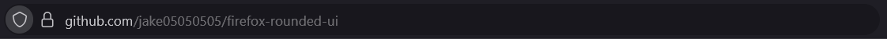
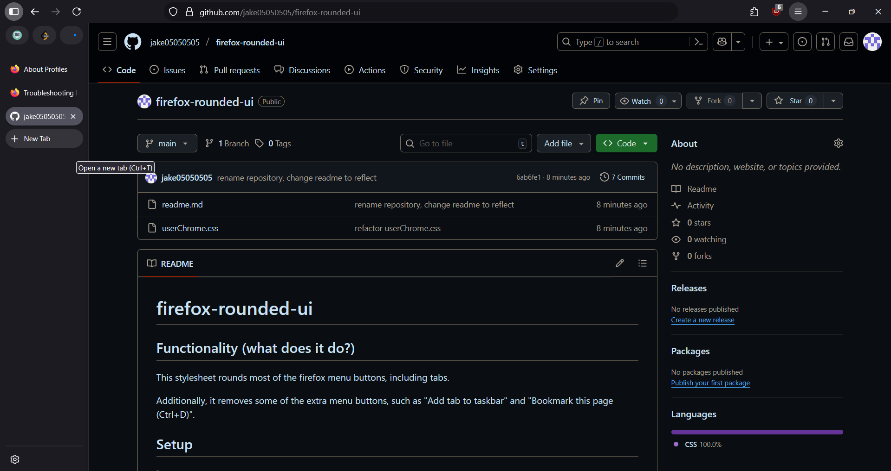
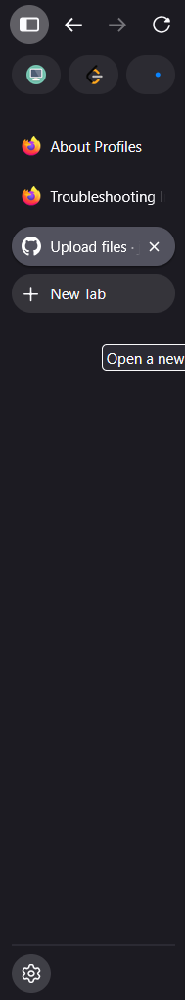

# firefox-rounded-ui

## Functionality (what does it do?)

This stylesheet rounds most of the firefox menu buttons, including tabs.

Additionally, it removes some of the extra menu buttons, such as "Add tab to taskbar" and "Bookmark this page (Ctrl+D)".

## Screenshots

 






## Setup

>### 1. Allow stylesheets to be rendered by firefox
> - type `about:config`, click "Accept" if prompted.
> - find `toolkit.legacyUserProfileCustomizations.stylesheets` using the searchbox.
> - toggle the setting above either by double clicking it, or clicking the toggle button to its right.

>### 2. Finding your firefox profile folder
> - type `about:support` into your address bar. Alternatively, you can enter `about:profiles`.
> - if using `about:support`, look for the heading "Application Basics", scroll down until you see the field "Profile Folder", click the "Open Folder" button.
> - if using `about:profiles`, find your default profile (`Default Profile: yes`), find the Root Directory field and click "Open Folder".

>### 3. Setting up userChrome.css
> - after step 2, your default file explorer should open to `Firefox/Profiles/___.default-release-___`
> - in this directory, create a new folder called `chrome`.
> - enter the new folder.
> - now you can copy the [`userChrome.css`](https://github.com/jake05050505/firefox-rounded-ui/blob/main/userChrome.css) file from the github repository, or create a new file called `userChrome.css`, and copy/paste the contents of the [`userChrome.css`](userChrome.css) file into the one you created (The same code can also be found below).
> - If you know how, you are free to customize the styling in any way you'd like, add/remove styling rules, etc.

```
#back-button > .toolbarbutton-icon,
#forward-button > .toolbarbutton-icon,
#reload-button > .toolbarbutton-icon,
#stop-button > .toolbarbutton-icon,

.toolbarbutton-badge-stack,
.identity-box-button,
#tracking-protection-icon-container,
#urlbar-searchmode-switcher {
    border-radius: 9999px !important;
}

.button-background {
    border-radius: 9999px !important;
}

.tab-background,
#tabs-newtab-button {
    border-radius: 20px !important;
}

#unified-extensions-button > .toolbarbutton-icon {
    border-radius: 11px !important;
}

.urlbar-background {
    border-radius: 20px !important;
}

.urlbar-page-action {
    visibility: hidden !important;
}
```
